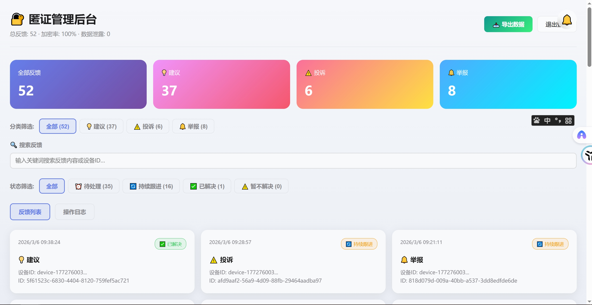
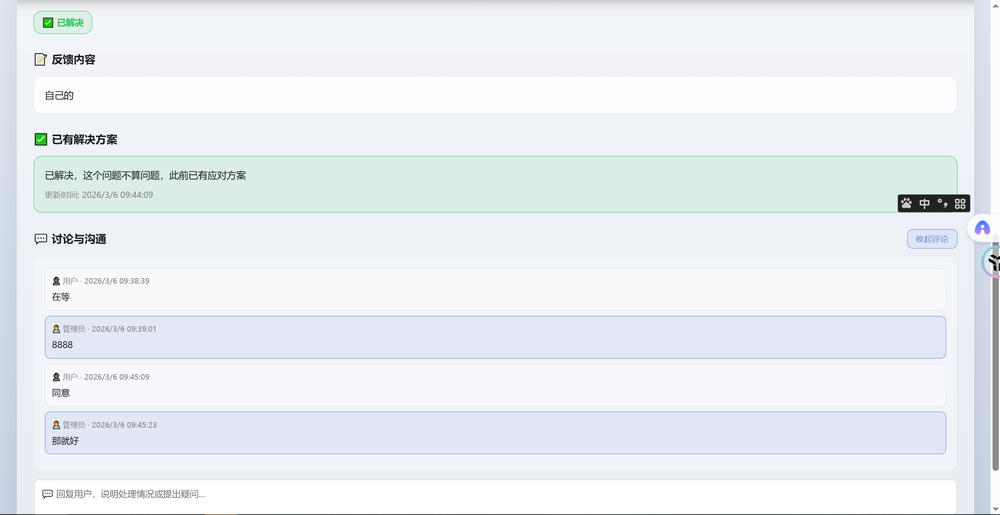
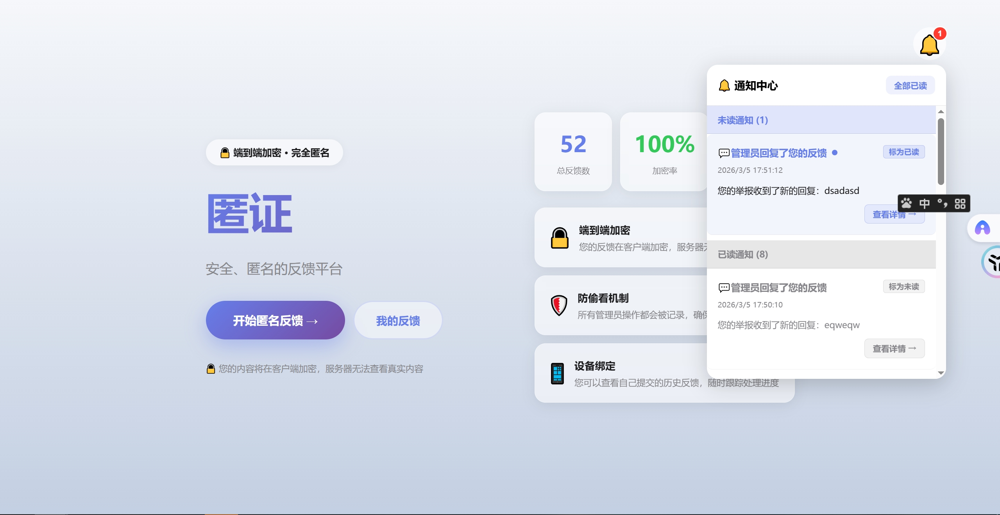
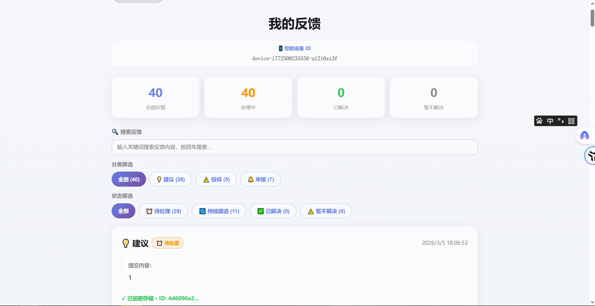
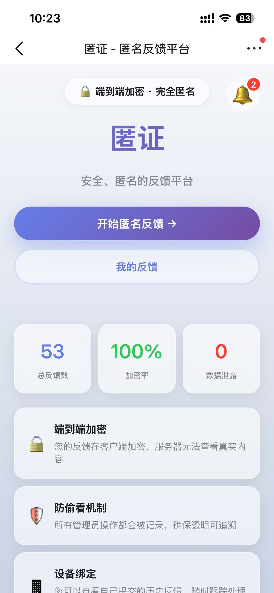
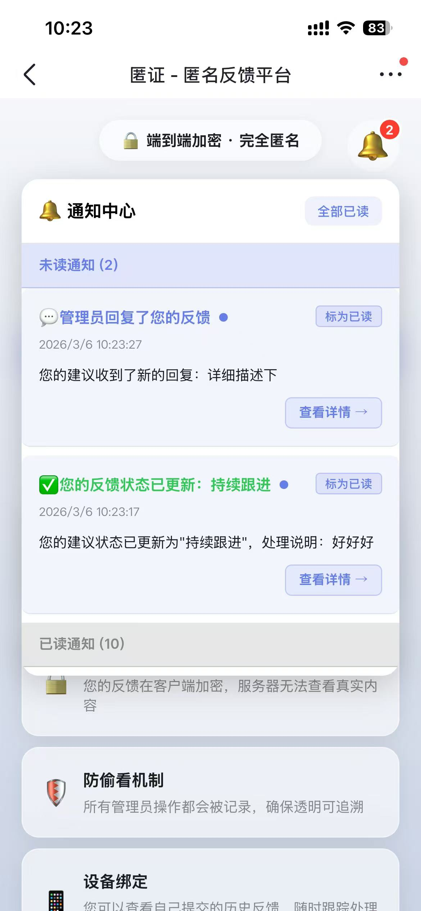
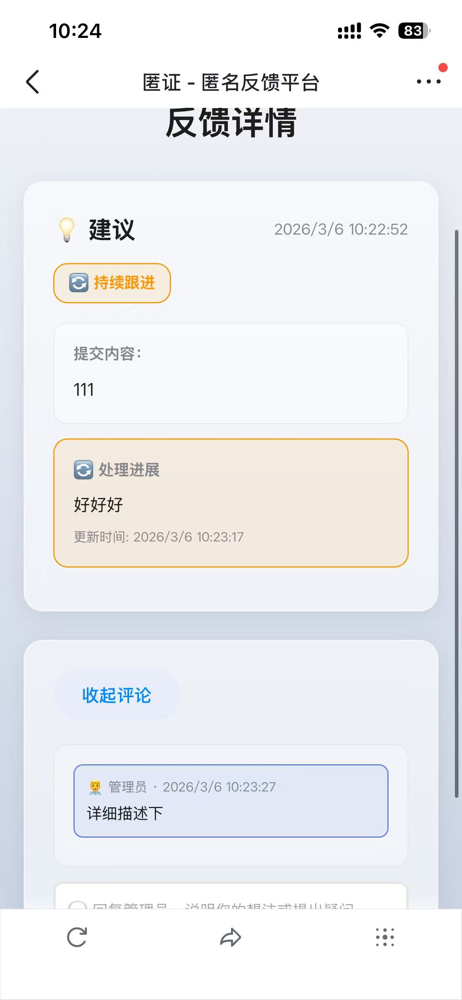

# 🔒 AnonyProof - 匿证

<div align="center">

**完全匿名 · 端到端加密 · 防偷看机制**

[](https://opensource.org/licenses/MIT)
[](https://www.typescriptlang.org/)
[](https://nextjs.org/)
[](https://nodejs.org/)

[功能特性](#-功能特性) • [快速开始](#-快速开始) • [技术架构](#%EF%B8%8F-技术架构) • [部署指南](#-部署指南) • [贡献指南](#-贡献指南)

</div>

---

## ✨ 项目简介

**AnonyProof（匿证）** 是一个现代化的匿名反馈平台，旨在为用户提供一个安全、私密的意见反馈渠道。采用端到端加密技术，确保用户的反馈内容在传输和存储过程中完全保密，即使是服务器管理员也无法查看真实内容。

> 💡 **独立开发**: 本项目**完全独立开发**，**未借鉴任何现有开源项目**。从需求分析、架构设计、前后端开发到部署上线，全部由作者一个人完成，采用 **Vibe Coding** 方式打造，不依赖任何脚手架或模板。

### 🎯 核心价值

- **🔒 完全匿名** - 无需注册登录，基于设备 ID 识别，彻底保护用户身份
- **🛡️ 端到端加密** - 采用 AES-256 加密算法，客户端加密，服务器无法解密
- **👁️ 防偷看机制** - 所有管理员操作都被记录，确保透明可追溯
- **💬 实时沟通** - 内置评论系统，支持用户与管理员双向交流
- **🔔 智能通知** - 实时通知系统，及时跟进反馈进度

---

## 🌟 功能特性

### 用户端

- ✅ **匿名反馈提交** - 支持建议/投诉/举报三种类型
- ✅ **我的反馈管理** - 查看所有历史反馈及处理状态
- ✅ **智能筛选搜索** - 按分类/状态筛选，关键词搜索
- ✅ **评论互动** - 与管理员实时沟通，补充说明
- ✅ **实时通知** - 新消息即时提醒
- ✅ **响应式设计** - 完美适配桌面端和移动端

### 管理端

- ✅ **安全管理** - 密码保护的管理后台
- ✅ **反馈管理** - 查看所有反馈，批量处理
- ✅ **状态更新** - 待处理/持续跟进/已解决/暂不解决
- ✅ **解决方案** - 记录处理意见和解决方案
- ✅ **操作日志** - 完整记录所有管理操作，防偷看
- ✅ **数据导出** - 支持 CSV 格式导出
- ✅ **统计面板** - 实时查看反馈统计数据

---

## 📸 界面展示

| 管理端主页（💻） | 管理端评论页（💻） |
|---|---|
| 设备认证管理后台界面，显示总反馈 52 条（建议 37、投诉 6、举报 8），包含分类筛选、状态筛选、搜索框、反馈列表、导出数据、退出按钮与通知图标。 | 反馈界面显示“已有解决方案”已勾选，绿色框展示处理结论；下方“讨论与沟通”区展示用户与管理员对话，底部有回复输入框与“收起评论”按钮。 |
|  |  |

| 用户端带通知主页（💻） | 用户端我的反馈页（💻） |
|---|---|
| 左侧为“匿证”首页入口，包含“开始匿名反馈”“我的反馈”按钮与“端到端加密·完全匿名”提示；右侧为通知中心，显示未读通知与已读通知。 | 页面标题为“我的反馈”，展示设备 ID、反馈统计、搜索框、分类筛选、状态筛选，以及反馈列表与加密存储提示。 |
|  |  |

| 用户端主页移动版（📱） | 用户端通知详情页移动版（📱） |
|---|---|
| 移动端首页展示“匿证 - 匿名反馈平台”、通知铃铛、总反馈数 53、加密率 100%、数据泄露 0，以及“端到端加密 / 防偷看机制 / 设备绑定”等功能说明。 | 通知中心显示未读通知（2）与已读通知（10），包含管理员回复与状态更新，并带有“标为已读”“查看详情”等操作入口。 |
|  |  |

| 用户端反馈详情页移动版（📱） |
|---|
| 反馈详情页展示反馈类型、状态、提交内容、处理进展、评论区与管理员回复内容，适合展示用户查看处理进度的完整流程。 |
|  |

---

## 🏗️ 技术架构

### 前端技术栈

```
Next.js 14.2.5          - React 框架
React 18.3.1            - UI 库
TypeScript 5.0          - 类型安全
Tailwind CSS            - 样式框架
Crypto-JS               - 客户端加密
```

### 后端技术栈

```
Express 5.2.1           - Web 框架
Node.js 22+             - 运行环境
SQLite                  - 数据库
better-sqlite3          - SQLite 驱动
UUID                    - 唯一标识生成
```

### 部署架构

```
Nginx                   - 反向代理
PM2                     - 进程管理
Docker                  - 容器化（可选）
```

### 加密方案

```
AES-256-GCM             - 对称加密算法
随机 IV                 - 初始化向量
Key Derivation          - 密钥派生
```

---

## 🚀 快速开始

### 环境要求

- Node.js >= 18.0.0
- npm >= 9.0.0
- SQLite 3

### 安装步骤

1. **克隆项目**
```bash
git clone https://github.com/HachikoJ/anonyproof.git
cd anonyproof
```

2. **安装依赖**
```bash
npm install
cd server && npm install
```

3. **配置环境变量**
```bash
cp .env.example .env.local
nano .env.local
```

4. **启动开发服务器**
```bash
cd server && npm run dev
npm run dev
```

5. **访问应用**
- 用户端: http://localhost:3000
- 管理端: http://localhost:3000/foorpynona

---

## 📦 部署指南

详见 `docs/DEPLOYMENT.md`。

---

## 📁 项目结构

```text
anonyproof/
├── app/
├── server/
├── docs/
├── public/
├── package.json
└── README.md
```

---

## 🔒 安全性说明

- ✅ 客户端加密
- ✅ 服务器仅存储加密内容
- ✅ 管理员操作可审计
- ✅ 防偷看机制

---

## 🗺️ 路线图

### v1.1（计划中）
- [ ] WebSocket 实时通知
- [ ] 图片/文件上传
- [ ] 深色模式
- [ ] 多语言支持

### v1.2（未来）
- [ ] 匿名投票功能
- [ ] 匿名问卷调查
- [ ] 移动端 App
- [ ] 数据可视化仪表板

---

## 🤝 贡献指南

欢迎 Fork、提 Issue、提 PR。

---

## 📄 许可证

本项目采用 MIT 许可证 - 详见 `LICENSE`

---

## 👥 作者

**Wilson** - [@HachikoJ](https://github.com/HachikoJ)

**💬 联系我**: 微信（广东 深圳）- 备注 "AnonyProof"

> 💡 **关于项目**: AnonyProof 是一个**完全独立开发**的项目，**未借鉴任何现有开源项目**。从需求分析、架构设计、前后端开发到部署上线，全部由作者一个人完成，采用 **Vibe Coding** 方式打造。

---

## 🙏 致谢

- [Next.js](https://nextjs.org/)
- [Express](https://expressjs.com/)
- [Crypto-JS](https://cryptojs.gitbook.io/)
- [Better SQLite3](https://github.com/WiseLibs/better-sqlite3)

---

## 📞 联系方式

- 项目主页: [https://github.com/HachikoJ/anonyproof](https://github.com/HachikoJ/anonyproof)
- 问题反馈: [GitHub Issues](https://github.com/HachikoJ/anonyproof/issues)

---

## ⭐ Star History

如果这个项目对你有帮助，请给个 Star ⭐

[](https://star-history.com/#HachikoJ/anonyproof&Date)

---

<div align="center">

**Made with ❤️ by Wilson**

[⬆ 返回顶部](#-anonyproof---匿证)

---

## ☕ 觉得有用？请我喝杯咖啡！

如果 AnonyProof 对你有帮助，欢迎直接扫码支持：

| 作者微信 | 微信收款码 | 支付宝收款码 |
|---|---|---|
|  |  |  |

或者给个项目 Star ⭐

> 💡 **本项目完全由独立开发，未借鉴任何现有开源项目，采用 Vibe Coding 方式打造。**

</div>
