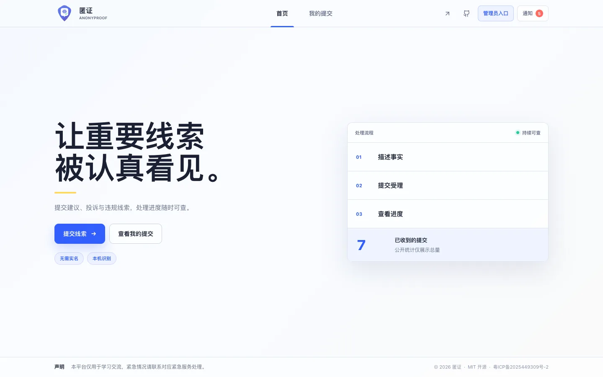
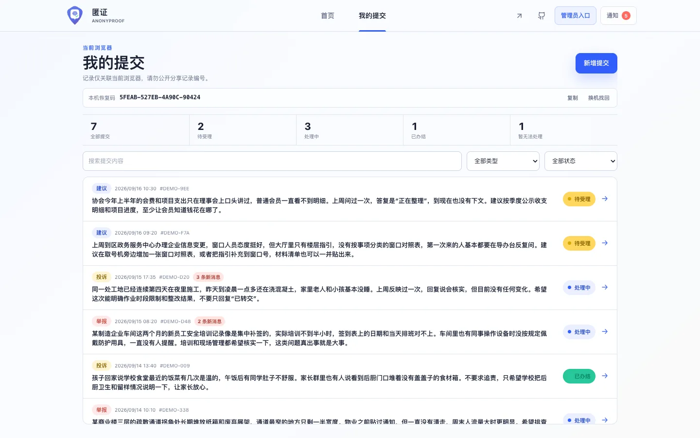
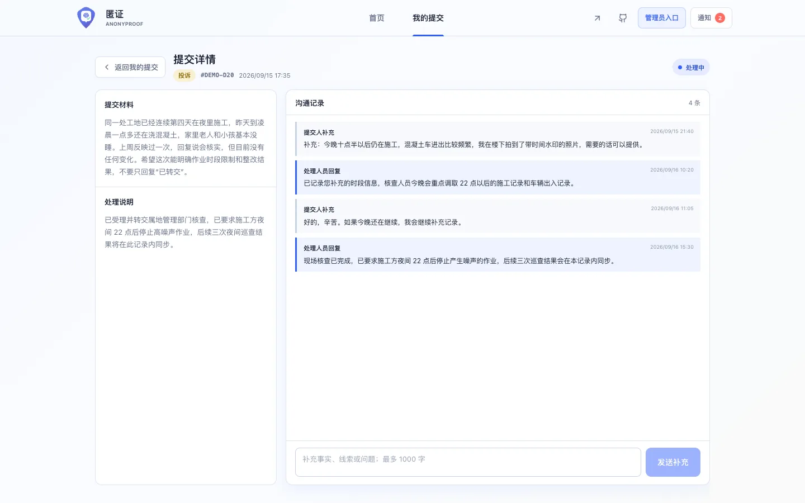
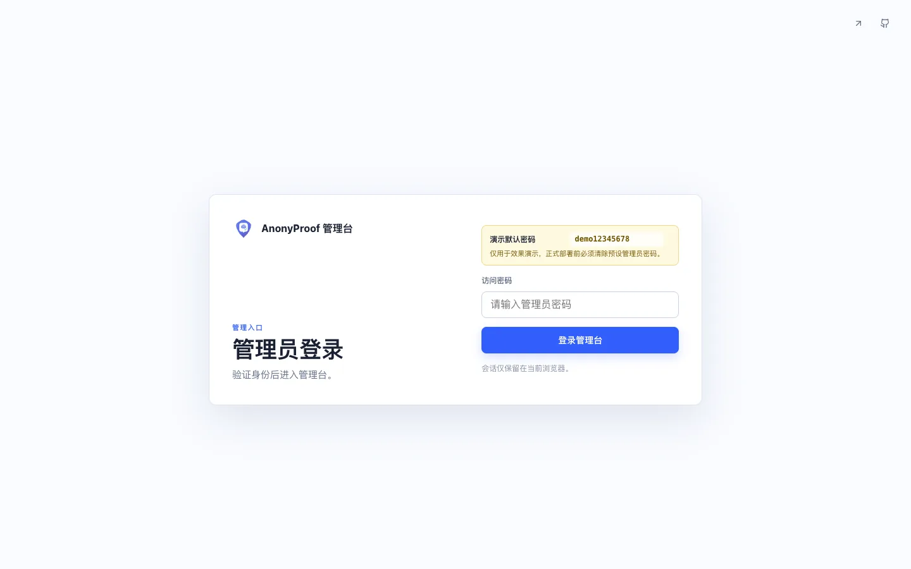
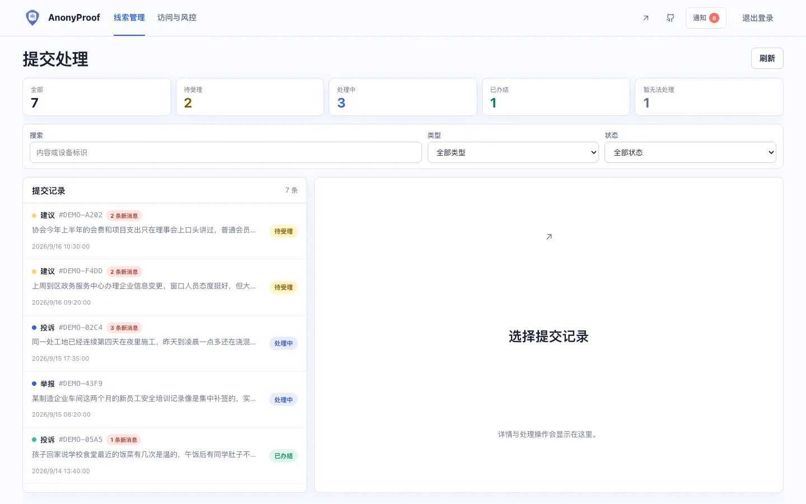
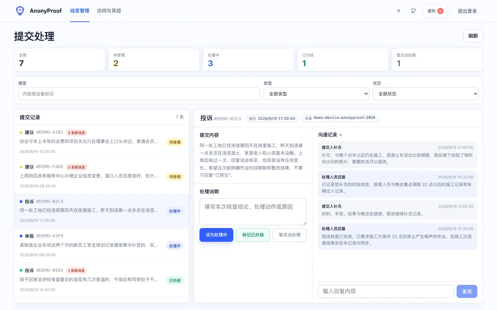
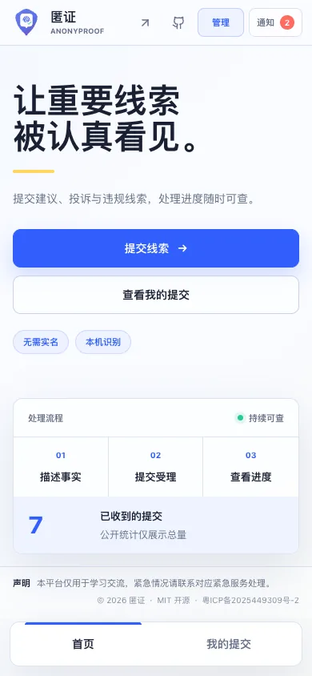
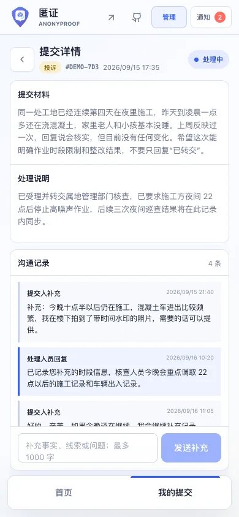

# 🔒 AnonyProof · 匿证

<div align="center">


**匿名线索提交与跟进平台**

[](https://opensource.org/licenses/MIT)
[](https://nextjs.org/)
[](https://react.dev/)
[](https://www.typescriptlang.org/)
[](https://expressjs.com/)
[](https://nodejs.org/)

[线上演示](#-线上演示) • [功能特性](#-功能特性) • [界面展示](#-界面展示) • [快速开始](#-快速开始) • [部署](#-部署) • [开源协议](#-开源协议)

</div>

---

## 🌐 线上演示

| 入口 | 地址 | 说明 |
| --- | --- | --- |
| 用户端（演示站） | <https://anonyproof.deline.top/anonyproof> | 匿名提交线索，凭本机身份查看进度、通知与补充沟通 |
| 管理端 | <https://anonyproof.deline.top/anonyproof/foorpynona> | 演示密码 `demo12345678`，登录后可处理全部线索 |
| 访问与风控 | <https://anonyproof.deline.top/anonyproof/access-stats> | 访问统计、访问日志、可疑 IP 与黑名单 |
| 项目介绍页 | <https://hachikoj.github.io/anonyproof/> | GitHub Pages 上的静态介绍页 |
| 源码仓库 | <https://github.com/HachikoJ/anonyproof> | 当前仓库 |

> ⚠️ **演示环境说明**：线上站点开启了 `DEMO_MODE`，管理员密码固定为 `demo12345678` 并直接展示在登录页，示例数据按浏览器各存一份副本。自己部署时请改为 `DEMO_MODE=0` 并设置真实密码，详见[部署](#-部署)。

---

## ✨ 项目简介

**匿证（AnonyProof）** 是一个面向企业、学校、社会组织与公共服务场景的匿名线索提交平台。提交人无需注册、无需实名，用一段文字说清事实即可生成记录编号，之后在同一页里查看处理状态、接收通知、继续补充材料；处理方通过密码登录管理台，完成受理、跟进、办结与留痕。

它解决的是同一个老问题：想反映问题的人担心暴露身份，而受理问题的人又需要一个可追踪、可回复、可归档的通道。

### 适用场景

- **企业内部**：安全生产、培训记录、食堂与后勤、流程改进建议
- **学校内部**：食堂卫生、宿舍管理、教学安排、校园安全
- **社会组织**：会费与项目支出公示、内部治理、成员意见收集
- **公共服务**：窗口服务建议、施工扰民、通道占用、办事流程反馈

### 设计取向

- **一屏完成**：首页、提交、我的提交、提交详情、管理台列表均按单屏布局设计，减少滚动与信息噪音
- **状态一致**：`待受理 → 处理中 → 已办结 / 暂无法处理`，用户端与管理端使用同一套标签与配色
- **沟通留痕**：每条线索保留完整沟通记录，处理说明与状态变更都在同一条记录内

---

## 🌟 功能特性

### 用户端

- ✅ **匿名提交** - 建议 / 投诉 / 举报三种类型，无需注册与实名
- ✅ **本机身份** - 由浏览器自动获得本机标识，无需账号即可查看自己的提交
- ✅ **恢复码找回** - 更换设备或清理浏览器数据后，可用恢复码找回原有记录
- ✅ **进度可见** - 四种状态与处理说明直接展示在提交详情中
- ✅ **补充沟通** - 在沟通记录中追加说明，与处理人员持续对话
- ✅ **通知中心** - 未读 / 已读分组，新回复与状态变化及时提醒
- ✅ **筛选与搜索** - 按类型、状态与关键词定位历史提交
- ✅ **响应式布局** - 桌面端与移动端分别适配，移动端同样保持单屏结构

### 管理端

- ✅ **密码登录** - 会话仅保留在当前浏览器，退出即失效
- ✅ **线索管理** - 状态统计、类型 / 状态筛选、关键词搜索
- ✅ **状态流转** - 设为处理中 / 标记已办结 / 暂无法处理，按钮直接反映当前状态
- ✅ **处理说明** - 记录处理结论，用户端同步可见
- ✅ **沟通记录** - 以处理人员身份回复，回复即时进入用户通知
- ✅ **访问与风控** - 访问统计、访问日志、可疑 IP 与 IP 黑名单
- ✅ **操作留痕** - 关键管理操作写入日志，便于回溯

---

## 📸 界面展示

截图取自线上演示站（2026-09）。

| 用户端首页（💻） | 我的提交（💻） |
| --- | --- |
| 一屏呈现标题、提交入口、处理流程与底部声明，公开统计只展示总量。 | 记录列表带类型、状态、时间与未读提示，支持搜索与状态筛选。 |
|  |  |

| 提交详情（💻） | 管理端登录（💻） |
| --- | --- |
| 左侧提交材料与处理说明，右侧沟通记录，底部固定补充输入框，两侧容器保持同一高度。 | 演示模式下列出默认密码，并明确提示正式部署前必须清除。 |
|  |  |

| 管理端线索管理（💻） | 管理端提交详情（💻） |
| --- | --- |
| 状态统计、筛选、搜索与记录列表集中在一屏，未读消息直接标注在记录上。 | 状态操作按钮、处理说明与沟通记录同屏，当前状态用按钮高亮表示。 |
|  |  |

| 移动端首页（📱） | 移动端提交详情（📱） |
| --- | --- |
| 移动端保留提交入口、处理流程与声明信息，导航压缩为栏内按钮。 | 类型、记录编号与时间压缩为标签行，为提交内容与沟通记录留出空间。 |
|  |  |

---

## 🧭 工作流程

1. **提交** - 用户在首页选择类型并描述事实，提交后获得记录编号
2. **受理** - 管理员登录管理台，在线索列表查看并标记为「处理中」
3. **跟进** - 双方在沟通记录中补充材料；每次回复都会生成用户端通知
4. **办结** - 管理员填写处理说明并标记为「已办结」或「暂无法处理」，用户端同步更新状态

---

## 🏗️ 技术架构

### 前端

```text
Next.js 16.3.3     - App Router 框架与页面路由
React 18.3.1       - 界面渲染
TypeScript 5       - 类型约束
Web Crypto API     - 浏览器端内容加密（AES-256-GCM）
```

### 后端

```text
Express 5.2.1      - HTTP 服务与 REST 接口
Node.js 20 LTS     - 运行环境
better-sqlite3     - SQLite 数据库驱动
express-rate-limit - 接口限流
winston            - 日志记录
uuid               - 标识生成
```

### 部署

```text
Nginx              - HTTPS 终止与反向代理
PM2                - 前后端进程守护
```

### 主要接口

| 方法 | 路径 | 用途 |
| --- | --- | --- |
| `GET` | `/api/identity` | 签发 / 读取本机身份，返回恢复码 |
| `POST` | `/api/identity/recover` | 用恢复码找回原有身份 |
| `POST` | `/api/feedback` | 提交线索 |
| `GET` | `/api/feedback/device/:deviceId` | 读取本机线索列表 |
| `GET/POST` | `/api/feedback/:id/comments` | 读取 / 追加沟通记录 |
| `GET` | `/api/notifications` | 通知列表与未读数 |
| `POST` | `/api/admin/auth/login` | 管理员登录 |
| `GET` | `/api/admin/feedbacks` | 管理端线索列表 |
| `PUT` | `/api/admin/feedback/:id/status` | 更新状态与处理说明 |
| `GET` | `/api/admin/access/stats` | 访问统计与风控数据 |

前端通过 Next.js rewrite 将 `/anonyproof/api/*` 代理到 Express 后端，生产环境由 Nginx 统一对外。

---

## 🔐 安全与隐私说明

- **身份隔离**：访问时由服务端签发 `HttpOnly` Cookie，并配合浏览器本地安装密钥共同绑定身份；只能读取自己名下的提交、通知与沟通记录，其他人拿到标识也无法查看
- **恢复码**：安装密钥负责本机续接，恢复码负责换设备找回；两者都不随网络请求以外的方式外传
- **管理鉴权**：管理员需密码登录，会话保存在 `HttpOnly` Cookie 中；登录接口有限流，异常访问会写入访问日志并进入可疑 IP 列表
- **操作留痕**：状态变更、删除等管理动作写入操作日志

### 关于内容加密

提交时浏览器会用 Web Crypto 生成 AES-256-GCM 密文（`encrypted_content`）入库。但需要明确说明：

- 当前实现把解密密钥与密文一起封装在同一个字段中，并把可读正文（`original_content`）一并入库，处理人才能在后台直接查看与检索
- 因此这是**演示级内容加密**，不等同于端到端加密，也不构成「服务器无法解密」的保证
- 如果需要真正的端到端加密，应改为用处理人公钥加密正文、服务端只保存密文，并放弃后台明文检索

---

## 🚀 快速开始

### 环境要求

- Node.js 20 LTS 或更高版本
- npm 9 或更高版本

### 安装与启动

```bash
# 1. 获取代码
git clone https://github.com/HachikoJ/anonyproof.git
cd anonyproof

# 2. 安装前后端依赖
npm install
npm --prefix server install

# 3. 准备环境变量
cp .env.example .env.local

# 4. 启动后端（默认 127.0.0.1:4000）
npm --prefix server run dev

# 5. 另开一个终端启动前端（默认 127.0.0.1:3000）
npm run dev
```

也可以直接执行 `bash scripts/start.sh`，脚本会检查 Node 版本、补齐依赖并同时启动前后端。

### 访问地址

- 用户端：<http://localhost:3000/anonyproof>
- 管理端：<http://localhost:3000/anonyproof/foorpynona>
- 访问与风控：<http://localhost:3000/anonyproof/access-stats>

### 常用命令

```bash
npm run build            # 构建前端
npm run start            # 以生产模式启动前端
npm run type-check       # 前端类型检查
npm --prefix server run type-check   # 后端类型检查
npm run pm2:prod         # 用 PM2 启动生产进程
```

---

## 🧪 演示模式

`.env.example` 默认启用演示模式：

```env
DEMO_MODE=1
DEMO_MAX_CLONES=3000
```

- 管理员密码固定为 `demo12345678`，并通过 `/api/demo/config` 提供给登录页展示
- 首次连接空库时写入 7 条示例线索，覆盖企业生产、学校食堂、社会组织会费、商业楼消防、工地扰民、政务服务等场景，附带沟通记录、通知与访问统计
- 每个新浏览器身份会复制一份独立副本，示例记录、未读状态与补充回复互不影响；达到 `DEMO_MAX_CLONES` 后只签发身份，不再复制
- 后台可同时看到示例模板与访客提交的真实线索，处理流程完全联动；管理员对示例记录的操作即时反映在该访客的副本里

关闭演示模式时不需要清库：把 `DEMO_MODE` 置为 `0` 并设置真实的 `ADMIN_PASSWORD`、`SESSION_SECRET` 后重启进程，`demo12345678` 立即失效，示例数据只是从界面隐藏，真实提交不会丢失。

---

## 📁 项目结构

```text
anonyproof/
├── app/                        # Next.js 页面、组件、类型与工具
│   ├── page.tsx                # 用户端：首页 / 提交 / 我的提交 / 提交详情
│   ├── foorpynona/page.tsx     # 管理端：登录、线索管理与处理
│   ├── access-stats/page.tsx   # 访问与风控
│   └── components/             # 通知、外部链接等公共组件
├── server/                     # Express + SQLite 后端
│   ├── index.ts                # 接口与数据库初始化
│   ├── demo.ts                 # 演示模式示例数据与身份副本
│   ├── env.ts                  # 环境变量加载
│   └── middleware/ utils/      # 鉴权、限流与日志工具
├── public/                     # 站点静态资源
├── deploy/                     # Nginx / PM2 部署配置
├── scripts/                    # 本地启动脚本
├── docs/                       # 介绍页、部署与设计文档、截图
├── archive/                    # 历史开发报告（只读参考）
├── ecosystem.prod.config.js    # 线上 PM2 入口
├── DEPLOY.md                   # 腾讯云部署说明
└── package.json
```

---

## 📦 部署

### 线上环境

| 项目 | 值 |
| --- | --- |
| 演示地址 | <https://anonyproof.deline.top/anonyproof> |
| 管理入口 | <https://anonyproof.deline.top/anonyproof/foorpynona> |
| 架构 | Nginx（HTTPS / 反向代理）→ Next.js :3000 → Express :4000 → SQLite |

### 生产环境检查清单

1. `DEMO_MODE=0`，并清理或归档示例数据
2. 设置 12 位以上的 `ADMIN_PASSWORD` 与至少 32 位随机 `SESSION_SECRET`
3. 修改默认 `API_TOKEN`，按实际域名设置 `CORS_ORIGINS`
4. 反向代理后设置 `TRUST_PROXY=1`，让限流与访问日志拿到真实 IP
5. 备份 `DATABASE_PATH` 指向的 SQLite 文件，并按需配置日志轮转
6. 定期检查管理操作日志与可疑 IP 列表

完整步骤见 [DEPLOY.md](DEPLOY.md) 与 [docs/DEPLOYMENT.md](docs/DEPLOYMENT.md)。

---

## 🗺️ 路线图

- [ ] WebSocket 实时通知（当前为轮询）
- [ ] 线索附件上传
- [ ] 深色模式
- [ ] 多语言支持
- [ ] 导出与统计报表

---

## 🤝 贡献指南

欢迎 Fork、提交 Issue 与 Pull Request，细节见 [CONTRIBUTING.md](CONTRIBUTING.md)。

---

## 📄 开源协议

本项目采用 MIT 许可证，详见 [LICENSE](LICENSE)。

Copyright © 2026 匿证（AnonyProof）

---

## 👥 作者

**Wilson** · 广东深圳 · [@HachikoJ](https://github.com/HachikoJ)

---

## 🙏 致谢

- [Next.js](https://nextjs.org/)
- [React](https://react.dev/)
- [Express](https://expressjs.com/)
- [better-sqlite3](https://github.com/WiseLibs/better-sqlite3)

---

## ⭐ Star History

[](https://star-history.com/#HachikoJ/anonyproof&Date)

---

<div align="center">

**Made with ❤️ by Wilson**

[⬆ 返回顶部](#-anonyproof--匿证)

</div>

---

## ☕ 觉得有用？请我喝杯咖啡！

| 作者微信 | 微信收款码 | 支付宝收款码 |
| --- | --- | --- |
|  |  |  |

---

## 📢 交流群

<p align="center">
  
</p>
